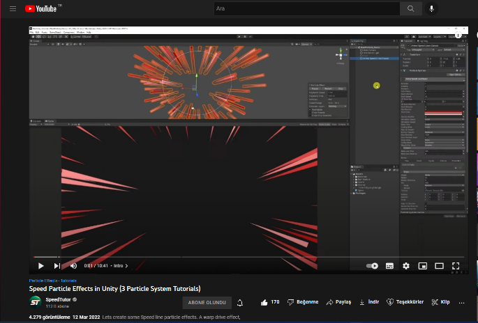
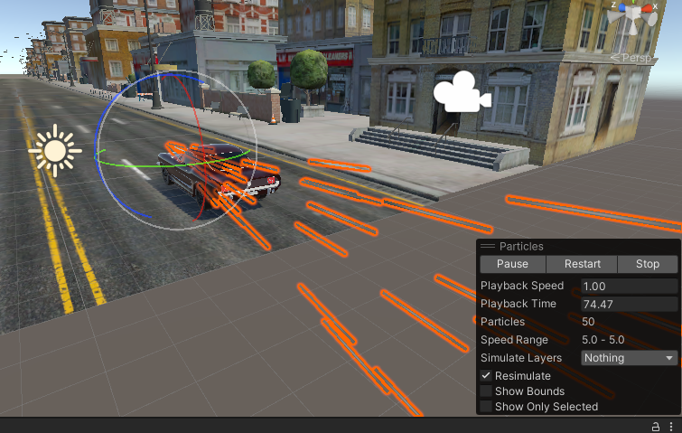
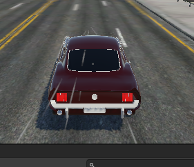

# 🌬️ WindParticles

A Unity prefab for realistic wind particle effects. Easily integrate wind simulations into your Unity scenes using this reusable particle system.

---

## 🇬🇧 English

### 🎯 Overview

This repository contains a **Unity prefab** for creating **dynamic and realistic wind particle effects**. Use this system to enhance your scenes with atmospheric wind visuals for games, simulations, or interactive experiences.

### ✅ Features

- Plug-and-play wind particle system  
- Customizable parameters:
  - Wind strength  
  - Wind direction  
  - Particle appearance
- Lightweight and performance-friendly
- Compatible with Unity’s Particle System module

### 🚀 How to Use

1. Download or clone this repository.
2. Import the `WindParticles.prefab` into your Unity project.
3. Drag and drop the prefab into your scene.
4. Adjust the particle system settings in the Inspector as needed.

## Sample Images

Below you can find sample images from the project:

---

## 🇹🇷 Türkçe

### 🎯 Genel Bakış

Bu depo, **Unity için gerçekçi rüzgar partikül efektleri** içeren bir **prefab** içerir. Bu sistemi kullanarak oyun, simülasyon veya etkileşimli projelerinize atmosferik rüzgar görselleri ekleyebilirsiniz.

### ✅ Özellikler

- Tak-çalıştır rüzgar partikül sistemi  
- Özelleştirilebilir parametreler:
  - Rüzgar gücü  
  - Rüzgar yönü  
  - Partikül görünümü
- Hafif ve performans dostu
- Unity’nin Particle System modülüyle uyumlu

### 🚀 Nasıl Kullanılır?

1. Depoyu indirin veya klonlayın.  
2. `WindParticles.prefab` dosyasını Unity projenize aktarın.  
3. Prefab’ı sahnenize sürükleyip bırakın.  
4. Inspector panelinden partikül sistemi ayarlarını ihtiyacınıza göre düzenleyin.

## Örnek Görseller

Aşağıda, projenin örnek görsellerini bulabilirsiniz:

---

## 📄 License

This project is licensed under the MIT License – feel free to use and modify it in your own projects.

